# 🔄 Comiketter データフロー図

## 概要
Comiketterの主要なデータフローを示す図です。API傍受からダウンロード、ブックマーク保存までの一連の流れを視覚化しています。

## メインデータフロー

```mermaid
flowchart TD
    %% 開始点
    A[ユーザーがX(Twitter)を閲覧] --> B[ContentScript注入]
    
    %% API傍受
    B --> C[API傍受開始]
    C --> D[XMLHttpRequest傍受]
    C --> E[fetch傍受]
    C --> F[webpackChunk傍受]
    
    D --> G[GraphQLレスポンス検出]
    E --> G
    F --> G
    
    %% レスポンス処理
    G --> H[レスポンス解析]
    H --> I{メディアファイルあり?}
    
    %% メディアファイル処理
    I -->|Yes| J[メディア情報抽出]
    I -->|No| K[通常のツイート処理]
    
    J --> L[ファイル名生成]
    L --> M[ダウンロード実行]
    M --> N[ダウンロード履歴保存]
    
    %% ブックマーク処理
    K --> O[カスタムブックマークボタン表示]
    O --> P[ユーザーがブックマーク選択]
    P --> Q[ブックマーク保存]
    Q --> R[ブックマーク履歴更新]
    
    %% 設定管理
    S[オプションページ] --> T[設定変更]
    T --> U[設定保存]
    U --> V[設定反映]
    
    %% データストレージ
    N --> W[IndexedDB: DownloadHistory]
    R --> X[IndexedDB: CustomBookmark]
    R --> Y[IndexedDB: BookmarkedTweet]
    U --> Z[IndexedDB: AppSettings]
    
    %% スタイル
    classDef apiNode fill:#e1f5fe
    classDef storageNode fill:#f3e5f5
    classDef processNode fill:#e8f5e8
    classDef userNode fill:#fff3e0
    
    class C,D,E,F,G,H apiNode
    class W,X,Y,Z storageNode
    class J,L,M,N,Q,R,T,U,V processNode
    class A,P,S userNode
```

## 詳細データフロー

### 1. API傍受フロー

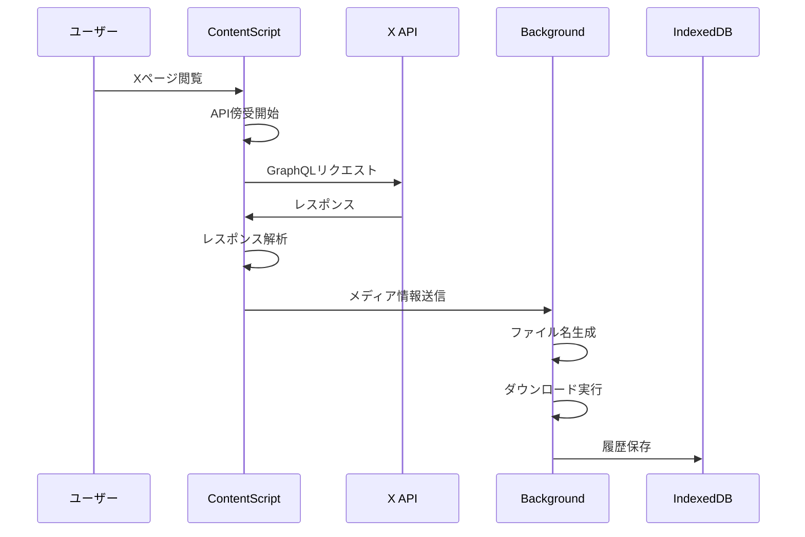

### 2. ブックマーク保存フロー

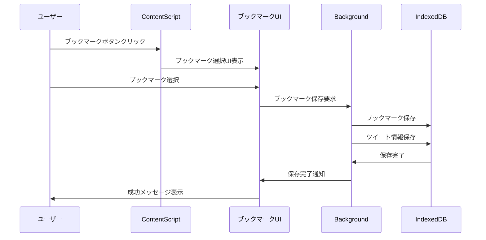

### 3. 設定管理フロー

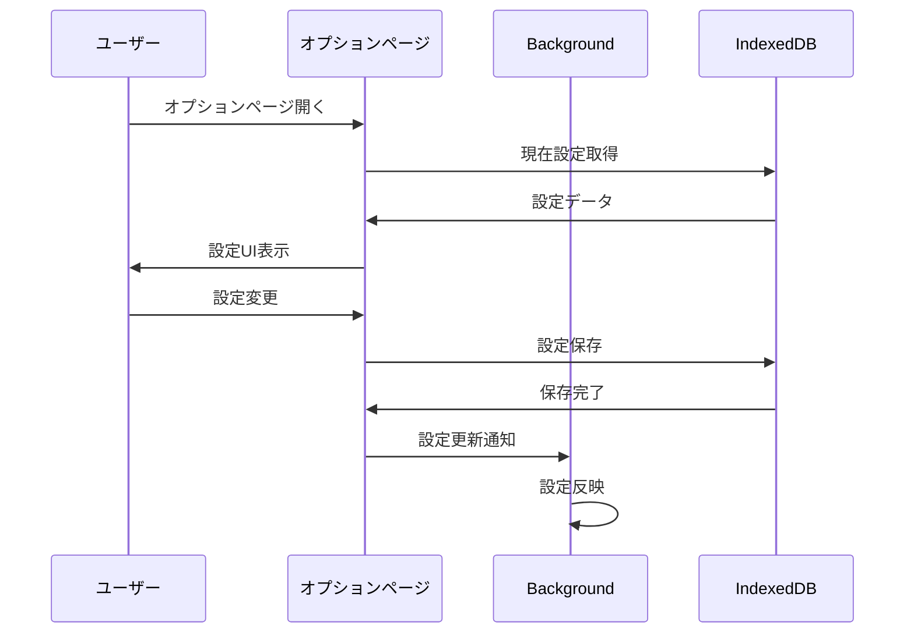

## データ変換フロー

### ツイートデータ変換

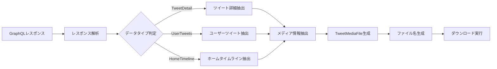

### ファイル名生成フロー

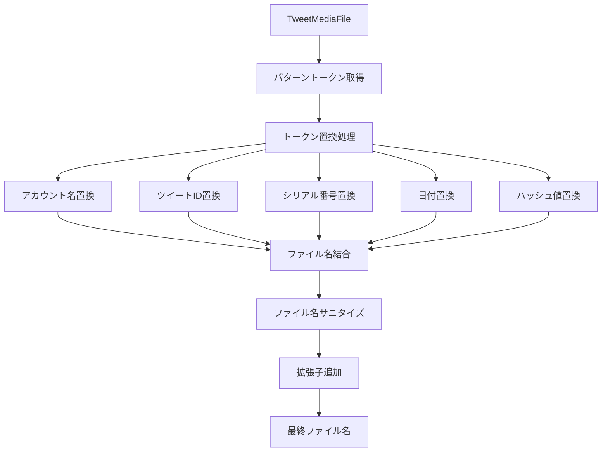

## エラーハンドリングフロー

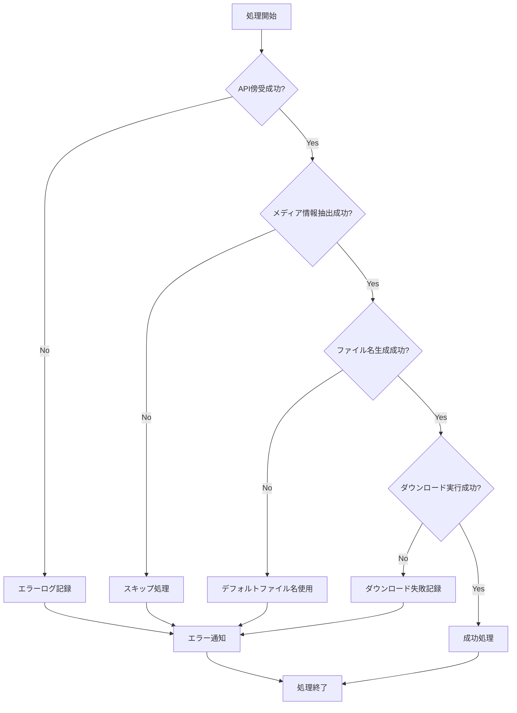

## パフォーマンス最適化フロー

### キャッシュ戦略

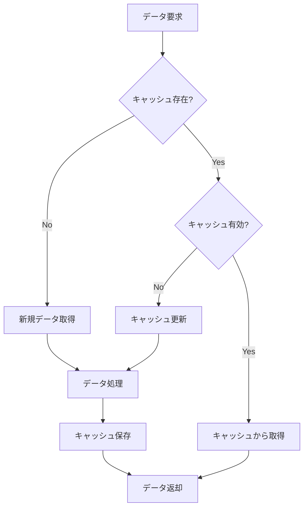

### バッチ処理

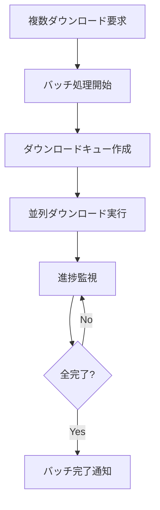

## セキュリティフロー

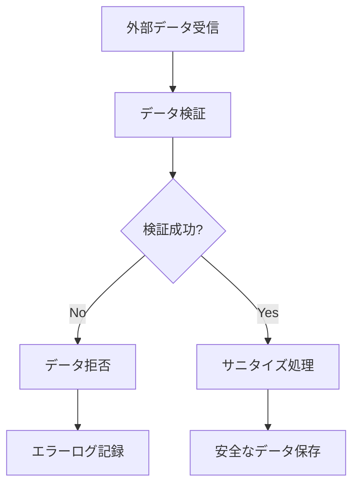

## 監視・ログフロー

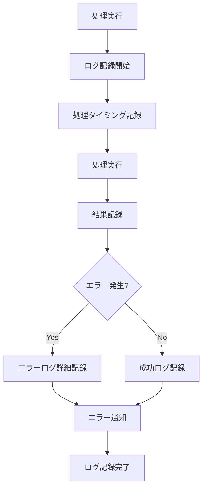

## データ永続化戦略

### ストレージ階層

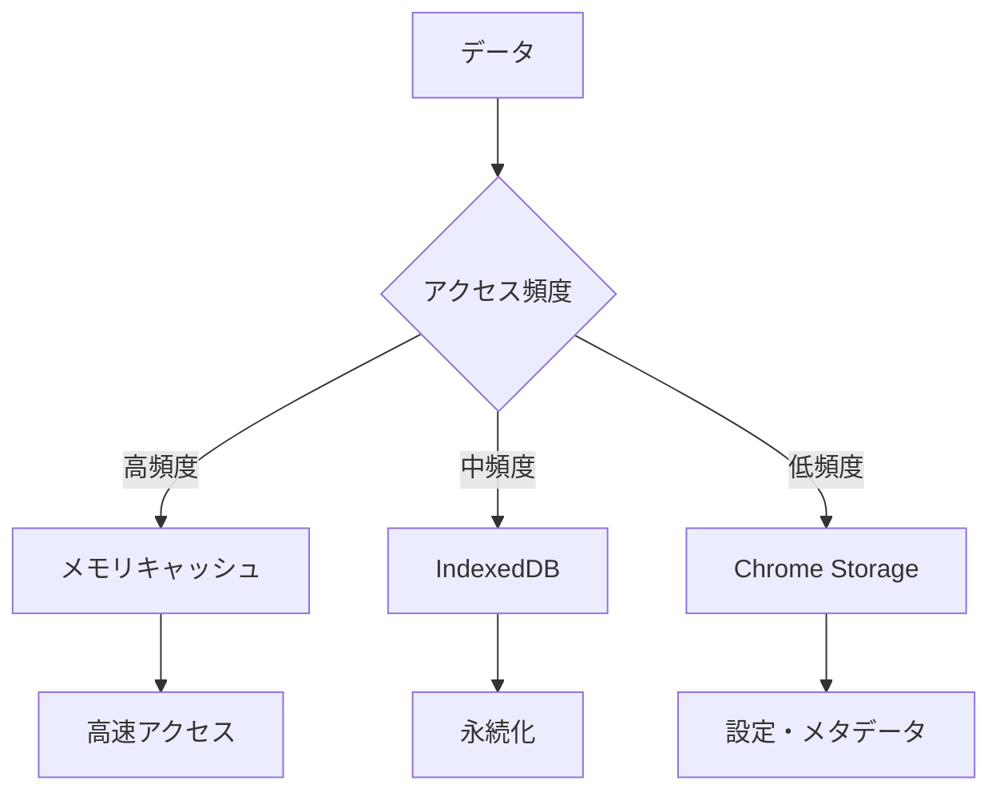

このデータフロー図により、Comiketterの複雑なデータ処理の流れが明確になり、開発時の理解と保守性が向上します。 