# 📊 Comiketter データフロー図

## 🔄 全体データフロー概要

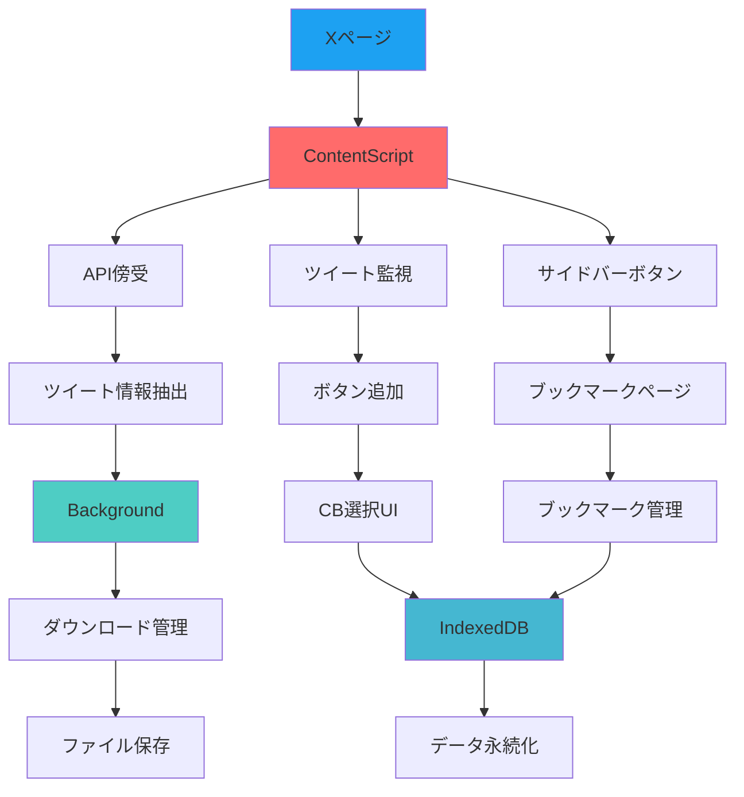

## 🎯 主要機能別データフロー

### 1. API傍受・ツイート監視フロー

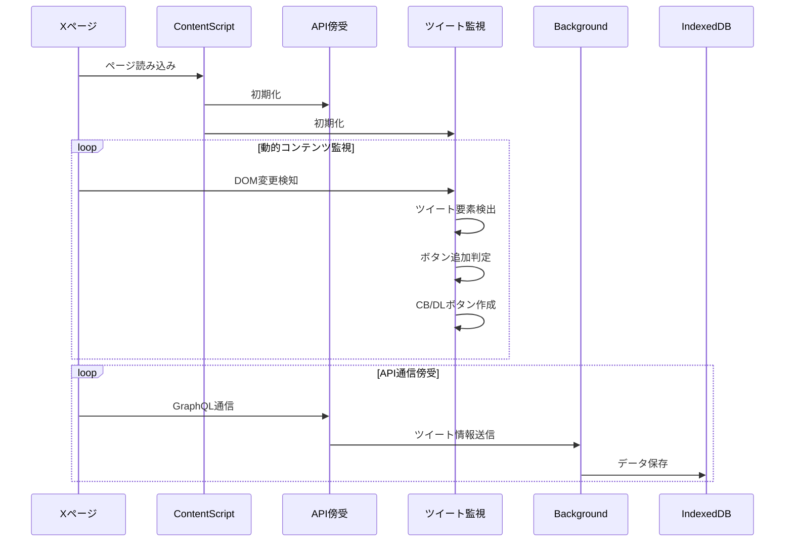

### 2. カスタムブックマーク（CB）フロー

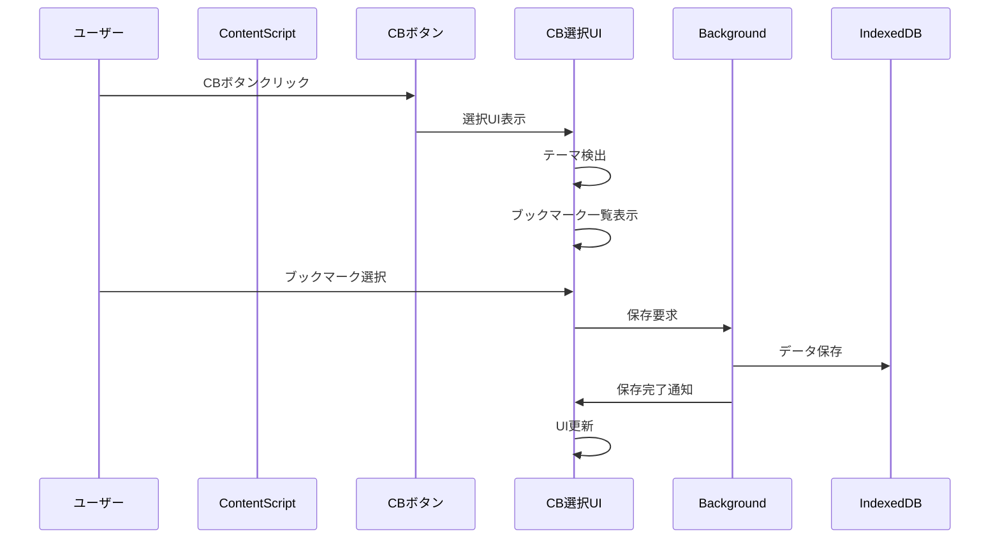

### 3. ダウンロードフロー

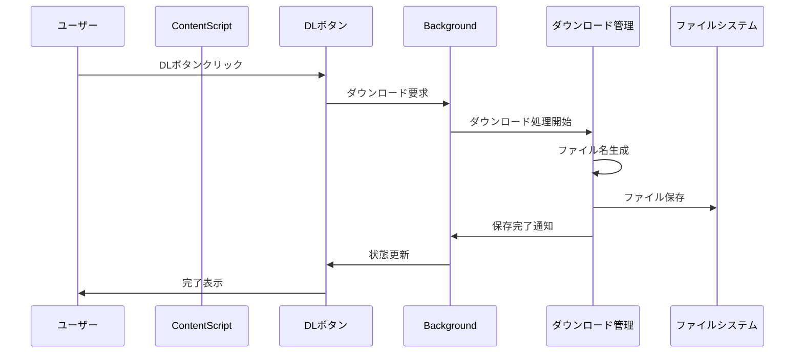

### 4. サイドバーボタンフロー

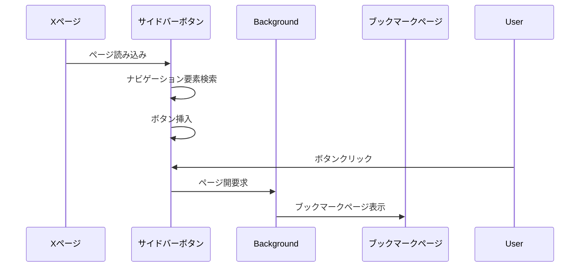

## 🗄️ データストレージ構造

### IndexedDB スキーマ

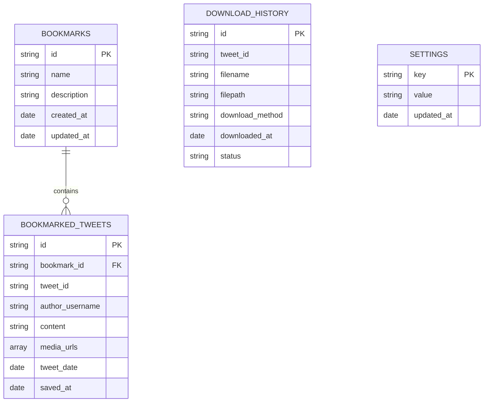

## 🔧 コンポーネント間通信

### メッセージング構造

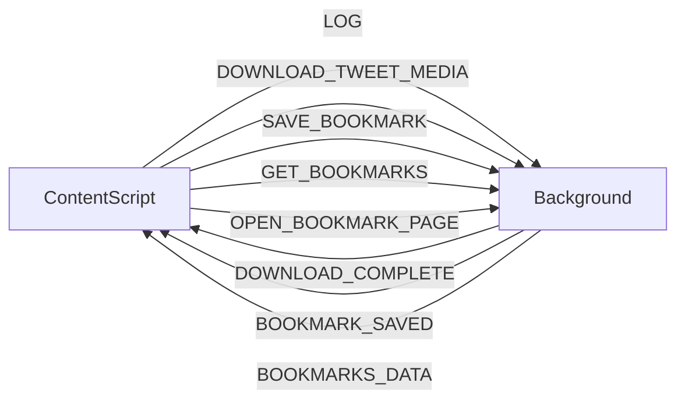

### イベントフロー

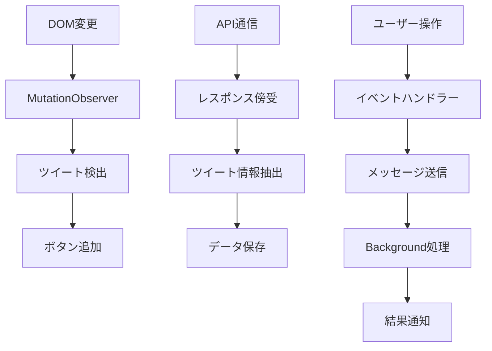

## 🎨 UI状態管理

### テーマ検出フロー

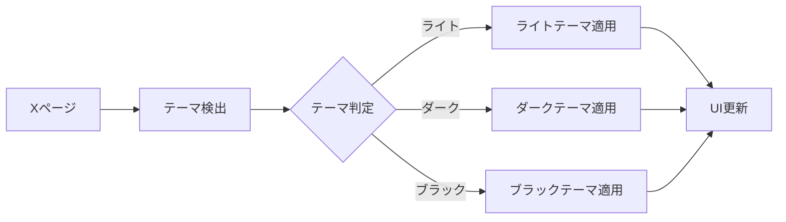

### ボタン状態管理

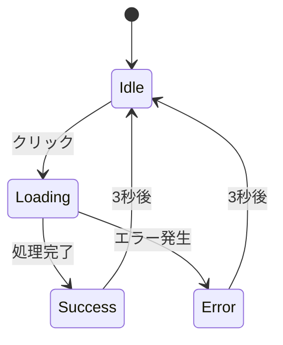

## 📊 パフォーマンス最適化

### バッチ処理フロー

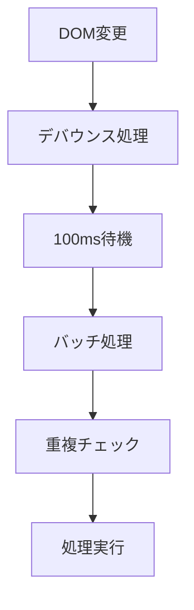

### メモリ管理

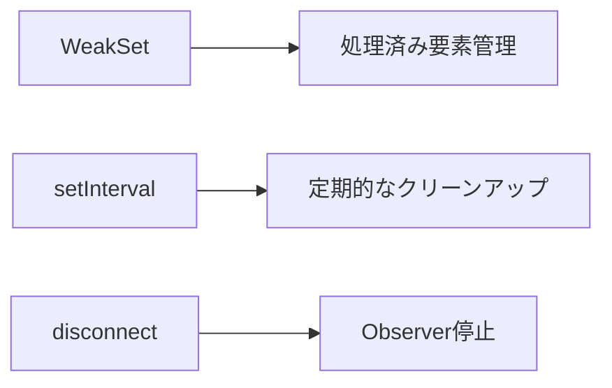

## 🔍 エラーハンドリング

### エラー処理フロー

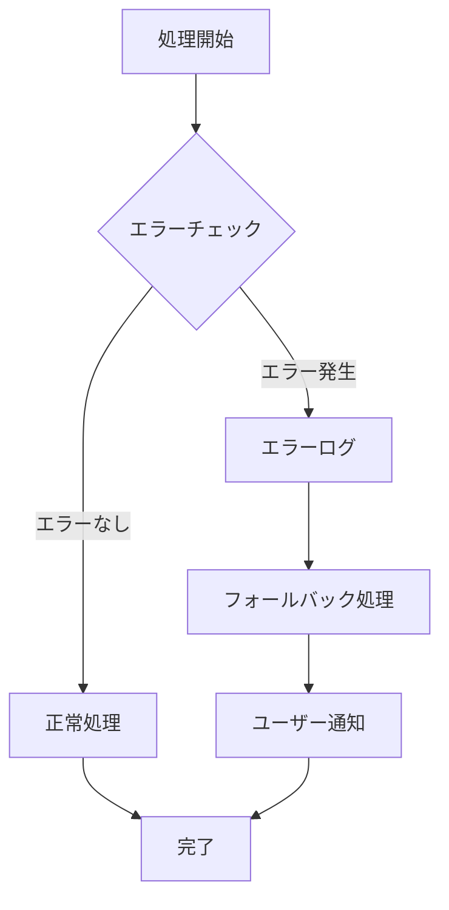

## 📈 監視・ログ

### ログフロー

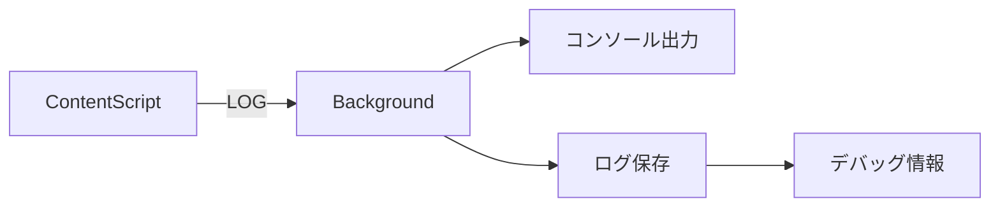

このデータフロー図は、Comiketterの現在の実装状況を反映しており、各コンポーネント間の相互作用とデータの流れを示しています。 