# 📊 Comiketter ER図（データベース設計）

## 概要
ComiketterはIndexedDBを使用してデータを永続化します。以下のER図は、主要なエンティティとその関係性を示しています。

## ER図



## データベース構造詳細

### 1. AppSettings（アプリケーション設定）
```typescript
interface AppSettings {
  id: string;                    // 主キー
  tlAutoUpdateDisabled: boolean; // タイムライン自動更新無効化
  downloadMethod: 'chrome-api' | 'native-messaging';
  saveFormat: 'url' | 'blob' | 'mixed';
  saveDirectory: string;
  autoDownloadConditions: {
    retweet: boolean;
    like: boolean;
    both: boolean;
  };
  autoSaveTriggers: {
    retweet: boolean;
    like: boolean;
    retweetAndLike: boolean;
  };
  filenameSettings: FilenameSettingProps;
  timelineAutoUpdate: boolean;
  showCustomBookmarks: boolean;
  createdAt: string;
  updatedAt: string;
}
```

### 2. FilenameSettings（ファイル名設定）
```typescript
interface FilenameSettingProps {
  id: string;                    // 主キー
  directory: string;             // ディレクトリ名
  noSubDirectory: boolean;       // サブディレクトリ無効化
  filenamePattern: PatternToken[]; // ファイル名パターン
  fileAggregation: boolean;      // ファイル集約
  groupBy: AggregationToken;     // グループ化方法
  settingsId: string;            // AppSettingsへの外部キー
}
```

### 3. CustomBookmark（カスタムブックマーク）
```typescript
interface CustomBookmark {
  id: string;                    // 主キー
  name: string;                  // ブックマーク名
  description?: string;          // 説明
  createdAt: string;             // 作成日時
  updatedAt: string;             // 更新日時
  tweetCount: number;            // ツイート数
  tweetIds: string[];            // ツイートID配列
}
```

### 4. BookmarkedTweet（ブックマークされたツイート）
```typescript
interface BookmarkedTweet {
  id: string;                    // 主キー
  tweetId: string;               // ツイートID
  bookmarkId: string;            // ブックマークID（外部キー）
  savedAt: string;               // 保存日時
  tweet: Tweet;                  // ツイートデータ
  saveType: 'url' | 'blob' | 'mixed'; // 保存形式
}
```

### 5. DownloadHistory（ダウンロード履歴）
```typescript
interface DownloadHistory {
  id: string;                    // 主キー
  tweetId: string;               // ツイートID
  fileName: string;              // ファイル名
  filePath: string;              // ファイルパス
  downloadUrl: string;           // ダウンロードURL
  downloadedAt: string;          // ダウンロード日時
  downloadMethod: 'chrome-api' | 'native-messaging';
  accountName: string;           // アカウント名
  mediaUrl?: string;             // メディアURL
  filename?: string;             // ファイル名
  downloadPath?: string;         // ダウンロードパス
  fileSize?: number;             // ファイルサイズ
  status?: 'success' | 'failed' | 'pending'; // ステータス
}
```

### 6. TweetCache（ツイートキャッシュ）
```typescript
interface TweetCache {
  id: string;                    // 主キー
  tweetId: string;               // ツイートID
  tweetData: any;                // ツイートデータ
  cachedAt: string;              // キャッシュ日時
  expiresAt: string;             // 有効期限
}
```

### 7. TweetMediaFile（ツイートメディアファイル）
```typescript
interface TweetMediaFile {
  id: string;                    // 主キー
  tweetId: string;               // ツイートID（外部キー）
  screenName: string;            // スクリーンネーム
  userId: string;                // ユーザーID
  displayName: string;           // 表示名
  isProtected: boolean;          // 保護アカウント
  createdAt: Date;               // 作成日時
  serial: number;                // シリアル番号
  hash: string;                  // ハッシュ値
  source: string;                // ソースURL
  type: 'image' | 'video';       // メディアタイプ
  ext: string;                   // 拡張子
}
```

## インデックス設計

### 主要インデックス
1. **TweetCache.tweetId** - ツイート検索用
2. **BookmarkedTweet.bookmarkId** - ブックマーク内ツイート検索用
3. **DownloadHistory.tweetId** - ダウンロード履歴検索用
4. **TweetMediaFile.tweetId** - メディアファイル検索用
5. **DownloadHistory.downloadedAt** - 日付順ソート用
6. **CustomBookmark.createdAt** - 作成日順ソート用

## データ整合性制約

### 外部キー制約
- `BookmarkedTweet.bookmarkId` → `CustomBookmark.id`
- `TweetMediaFile.tweetId` → `TweetCache.tweetId`
- `FilenameSettings.settingsId` → `AppSettings.id`

### ビジネスルール
1. **カスタムブックマーク**: 1つのブックマークに複数のツイートを保存可能
2. **ダウンロード履歴**: 1つのツイートに複数のメディアファイルが存在可能
3. **設定**: アプリケーション全体で1つの設定のみ有効
4. **キャッシュ**: ツイートデータは有効期限付きでキャッシュ

## パフォーマンス考慮事項

### クエリ最適化
- 頻繁にアクセスされるデータ（設定、ブックマーク）はメモリキャッシュ
- 大量データ（ダウンロード履歴）はページネーション対応
- 検索クエリはインデックスを活用

### ストレージ効率
- 重複データは最小限に抑制
- 不要なデータは定期的にクリーンアップ
- メディアファイル情報は必要最小限のメタデータのみ保存

## 将来の拡張性

### コミケAPI連携
- `ComiketEvent` エンティティの追加
- `Circle` エンティティの追加
- `BookmarkedTweet` と `ComiketEvent` の関連付け

### 高度な検索機能
- フルテキスト検索インデックス
- タグ機能の追加
- フィルタリング機能の強化 