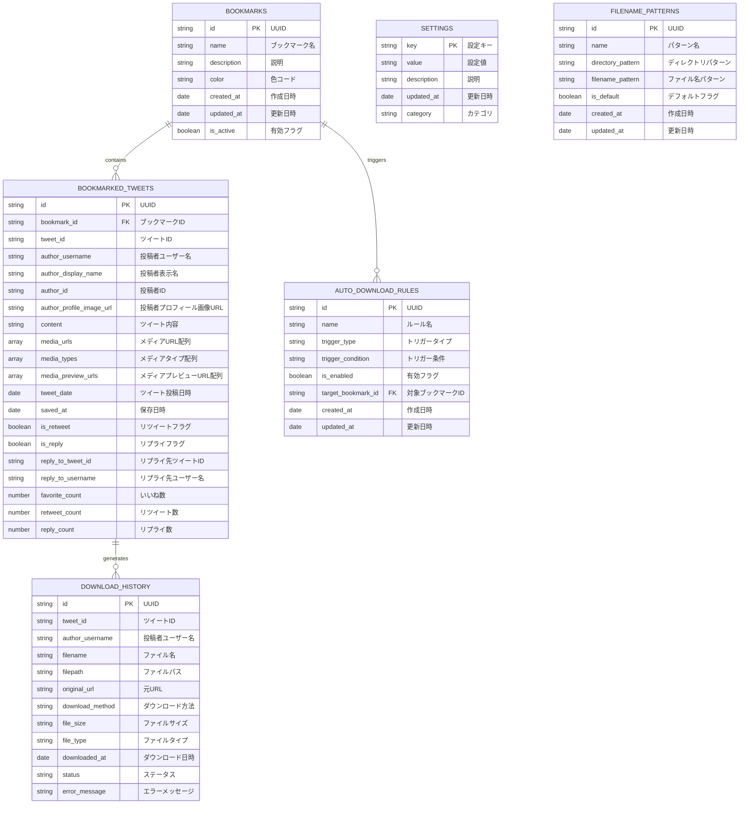

# 🗄️ Comiketter ER図（データベース設計）

## 📊 全体ER図



## 📋 テーブル詳細仕様

### 1. BOOKMARKS（ブックマーク管理）

| カラム名 | 型 | 制約 | 説明 |
|---------|----|------|------|
| id | string | PK | UUID形式の一意識別子 |
| name | string | NOT NULL | ブックマーク名（例：「1日目」「絶対行きたい」） |
| description | string | NULL | ブックマークの説明文 |
| color | string | NULL | 色コード（例：#FF6B6B） |
| created_at | date | NOT NULL | 作成日時 |
| updated_at | date | NOT NULL | 更新日時 |
| is_active | boolean | NOT NULL | 有効フラグ（削除時はfalse） |

**インデックス:**
- `idx_bookmarks_name` (name)
- `idx_bookmarks_created_at` (created_at)
- `idx_bookmarks_updated_at` (updated_at)

**注意事項:**
- `updated_at`は、ブックマークの作成・更新時に自動的に設定されます
- ツイートの追加・削除時にも、親ブックマークの`updated_at`が自動的に更新されます

### 2. BOOKMARKED_TWEETS（ブックマーク済みツイート）

| カラム名 | 型 | 制約 | 説明 |
|---------|----|------|------|
| id | string | PK | UUID形式の一意識別子 |
| bookmark_id | string | FK | BOOKMARKS.idへの外部キー |
| tweet_id | string | NOT NULL | XのツイートID |
| author_username | string | NOT NULL | 投稿者のユーザー名 |
| author_display_name | string | NULL | 投稿者の表示名 |
| author_id | string | NOT NULL | 投稿者のID |
| author_profile_image_url | string | NULL | 投稿者のプロフィール画像URL |
| content | string | NULL | ツイートの本文 |
| media_urls | array | NULL | メディアURLの配列 |
| media_types | array | NULL | メディアタイプの配列（image/video） |
| media_preview_urls | array | NULL | メディアプレビューURLの配列（動画/GIFのプレビュー用） |
| tweet_date | date | NOT NULL | ツイートの投稿日時 |
| saved_at | date | NOT NULL | ブックマーク保存日時 |
| is_retweet | boolean | NOT NULL | リツイートかどうか |
| is_reply | boolean | NOT NULL | リプライかどうか |
| reply_to_tweet_id | string | NULL | リプライ先のツイートID |
| reply_to_username | string | NULL | リプライ先のユーザー名 |
| favorite_count | number | NULL | いいね数（必須項目） |
| retweet_count | number | NULL | リツイート数（必須項目） |
| reply_count | number | NULL | リプライ数（必須項目） |

**インデックス:**
- `idx_bookmarked_tweets_bookmark_id` (bookmark_id)
- `idx_bookmarked_tweets_tweet_id` (tweet_id)
- `idx_bookmarked_tweets_author_username` (author_username)
- `idx_bookmarked_tweets_tweet_date` (tweet_date)
- `idx_bookmarked_tweets_saved_at` (saved_at)

### 3. DOWNLOAD_HISTORY（ダウンロード履歴）

| カラム名 | 型 | 制約 | 説明 |
|---------|----|------|------|
| id | string | PK | UUID形式の一意識別子 |
| tweet_id | string | NOT NULL | 元ツイートのID |
| author_username | string | NOT NULL | 投稿者のユーザー名 |
| filename | string | NOT NULL | 保存されたファイル名 |
| filepath | string | NOT NULL | 保存されたファイルパス |
| original_url | string | NOT NULL | 元のメディアURL |
| download_method | string | NOT NULL | ダウンロード方法（chrome_downloads/native_messaging） |
| file_size | string | NULL | ファイルサイズ（bytes） |
| file_type | string | NOT NULL | ファイルタイプ（image/jpeg, video/mp4等） |
| downloaded_at | date | NOT NULL | ダウンロード実行日時 |
| status | string | NOT NULL | ステータス（success/failed/in_progress） |
| error_message | string | NULL | エラー時のメッセージ |

**インデックス:**
- `idx_download_history_tweet_id` (tweet_id)
- `idx_download_history_author_username` (author_username)
- `idx_download_history_downloaded_at` (downloaded_at)
- `idx_download_history_status` (status)

### 4. SETTINGS（設定管理）

| カラム名 | 型 | 制約 | 説明 |
|---------|----|------|------|
| key | string | PK | 設定キー |
| value | string | NOT NULL | 設定値（JSON形式） |
| description | string | NULL | 設定の説明 |
| updated_at | date | NOT NULL | 更新日時 |
| category | string | NOT NULL | 設定カテゴリ（ui/download/filename等） |

**設定例:**
```json
{
  "ui.theme": "auto",
  "download.method": "chrome_downloads",
  "download.directory": "comiketter",
  "filename.pattern": "{account}-{tweetDate}-{tweetId}-{serial}",
  "auto_download.enabled": true,
  "auto_download.triggers": ["retweet", "like"]
}
```

### 5. FILENAME_PATTERNS（ファイル名パターン）

| カラム名 | 型 | 制約 | 説明 |
|---------|----|------|------|
| id | string | PK | UUID形式の一意識別子 |
| name | string | NOT NULL | パターン名 |
| directory_pattern | string | NOT NULL | ディレクトリパターン |
| filename_pattern | string | NOT NULL | ファイル名パターン |
| is_default | boolean | NOT NULL | デフォルトパターンかどうか |
| created_at | date | NOT NULL | 作成日時 |
| updated_at | date | NOT NULL | 更新日時 |

**パターン例:**
- ディレクトリ: `comiketter/{account}`
- ファイル名: `{account}-{tweetDate}-{tweetId}-{serial}`

### 6. AUTO_DOWNLOAD_RULES（自動ダウンロードルール）

| カラム名 | 型 | 制約 | 説明 |
|---------|----|------|------|
| id | string | PK | UUID形式の一意識別子 |
| name | string | NOT NULL | ルール名 |
| trigger_type | string | NOT NULL | トリガータイプ（retweet/like/retweet_and_like） |
| trigger_condition | string | NOT NULL | トリガー条件（JSON形式） |
| is_enabled | boolean | NOT NULL | 有効フラグ |
| target_bookmark_id | string | FK | 対象ブックマークID（NULL=全ブックマーク） |
| created_at | date | NOT NULL | 作成日時 |
| updated_at | date | NOT NULL | 更新日時 |
