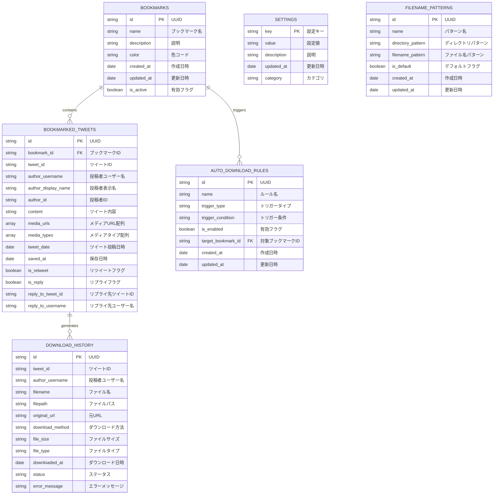
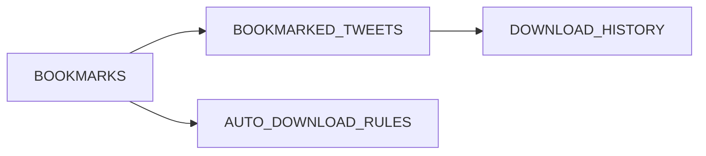

# 🗄️ Comiketter ER図（データベース設計）

## 📊 全体ER図



## 📋 テーブル詳細仕様

### 1. BOOKMARKS（ブックマーク管理）

| カラム名 | 型 | 制約 | 説明 |
|---------|----|------|------|
| id | string | PK | UUID形式の一意識別子 |
| name | string | NOT NULL | ブックマーク名（例：「1日目」「絶対行きたい」） |
| description | string | NULL | ブックマークの説明文 |
| color | string | NULL | 色コード（例：#FF6B6B） |
| created_at | date | NOT NULL | 作成日時 |
| updated_at | date | NOT NULL | 更新日時 |
| is_active | boolean | NOT NULL | 有効フラグ（削除時はfalse） |

**インデックス:**
- `idx_bookmarks_name` (name)
- `idx_bookmarks_created_at` (created_at)

### 2. BOOKMARKED_TWEETS（ブックマーク済みツイート）

| カラム名 | 型 | 制約 | 説明 |
|---------|----|------|------|
| id | string | PK | UUID形式の一意識別子 |
| bookmark_id | string | FK | BOOKMARKS.idへの外部キー |
| tweet_id | string | NOT NULL | XのツイートID |
| author_username | string | NOT NULL | 投稿者のユーザー名 |
| author_display_name | string | NULL | 投稿者の表示名 |
| author_id | string | NOT NULL | 投稿者のID |
| content | string | NULL | ツイートの本文 |
| media_urls | array | NULL | メディアURLの配列 |
| media_types | array | NULL | メディアタイプの配列（image/video） |
| tweet_date | date | NOT NULL | ツイートの投稿日時 |
| saved_at | date | NOT NULL | ブックマーク保存日時 |
| is_retweet | boolean | NOT NULL | リツイートかどうか |
| is_reply | boolean | NOT NULL | リプライかどうか |
| reply_to_tweet_id | string | NULL | リプライ先のツイートID |
| reply_to_username | string | NULL | リプライ先のユーザー名 |

**インデックス:**
- `idx_bookmarked_tweets_bookmark_id` (bookmark_id)
- `idx_bookmarked_tweets_tweet_id` (tweet_id)
- `idx_bookmarked_tweets_author_username` (author_username)
- `idx_bookmarked_tweets_tweet_date` (tweet_date)
- `idx_bookmarked_tweets_saved_at` (saved_at)

### 3. DOWNLOAD_HISTORY（ダウンロード履歴）

| カラム名 | 型 | 制約 | 説明 |
|---------|----|------|------|
| id | string | PK | UUID形式の一意識別子 |
| tweet_id | string | NOT NULL | 元ツイートのID |
| author_username | string | NOT NULL | 投稿者のユーザー名 |
| filename | string | NOT NULL | 保存されたファイル名 |
| filepath | string | NOT NULL | 保存されたファイルパス |
| original_url | string | NOT NULL | 元のメディアURL |
| download_method | string | NOT NULL | ダウンロード方法（chrome_downloads/native_messaging） |
| file_size | string | NULL | ファイルサイズ（bytes） |
| file_type | string | NOT NULL | ファイルタイプ（image/jpeg, video/mp4等） |
| downloaded_at | date | NOT NULL | ダウンロード実行日時 |
| status | string | NOT NULL | ステータス（success/failed/in_progress） |
| error_message | string | NULL | エラー時のメッセージ |

**インデックス:**
- `idx_download_history_tweet_id` (tweet_id)
- `idx_download_history_author_username` (author_username)
- `idx_download_history_downloaded_at` (downloaded_at)
- `idx_download_history_status` (status)

### 4. SETTINGS（設定管理）

| カラム名 | 型 | 制約 | 説明 |
|---------|----|------|------|
| key | string | PK | 設定キー |
| value | string | NOT NULL | 設定値（JSON形式） |
| description | string | NULL | 設定の説明 |
| updated_at | date | NOT NULL | 更新日時 |
| category | string | NOT NULL | 設定カテゴリ（ui/download/filename等） |

**設定例:**
```json
{
  "ui.theme": "auto",
  "download.method": "chrome_downloads",
  "download.directory": "comiketter",
  "filename.pattern": "{account}-{tweetDate}-{tweetId}-{serial}",
  "auto_download.enabled": true,
  "auto_download.triggers": ["retweet", "like"]
}
```

### 5. FILENAME_PATTERNS（ファイル名パターン）

| カラム名 | 型 | 制約 | 説明 |
|---------|----|------|------|
| id | string | PK | UUID形式の一意識別子 |
| name | string | NOT NULL | パターン名 |
| directory_pattern | string | NOT NULL | ディレクトリパターン |
| filename_pattern | string | NOT NULL | ファイル名パターン |
| is_default | boolean | NOT NULL | デフォルトパターンかどうか |
| created_at | date | NOT NULL | 作成日時 |
| updated_at | date | NOT NULL | 更新日時 |

**パターン例:**
- ディレクトリ: `comiketter/{account}`
- ファイル名: `{account}-{tweetDate}-{tweetId}-{serial}`

### 6. AUTO_DOWNLOAD_RULES（自動ダウンロードルール）

| カラム名 | 型 | 制約 | 説明 |
|---------|----|------|------|
| id | string | PK | UUID形式の一意識別子 |
| name | string | NOT NULL | ルール名 |
| trigger_type | string | NOT NULL | トリガータイプ（retweet/like/retweet_and_like） |
| trigger_condition | string | NOT NULL | トリガー条件（JSON形式） |
| is_enabled | boolean | NOT NULL | 有効フラグ |
| target_bookmark_id | string | FK | 対象ブックマークID（NULL=全ブックマーク） |
| created_at | date | NOT NULL | 作成日時 |
| updated_at | date | NOT NULL | 更新日時 |

## 🔗 リレーション詳細

### 1対多リレーション



### 外部キー制約

```sql
-- BOOKMARKED_TWEETS.bookmark_id -> BOOKMARKS.id
ALTER TABLE BOOKMARKED_TWEETS 
ADD CONSTRAINT fk_bookmarked_tweets_bookmark 
FOREIGN KEY (bookmark_id) REFERENCES BOOKMARKS(id) 
ON DELETE CASCADE;

-- AUTO_DOWNLOAD_RULES.target_bookmark_id -> BOOKMARKS.id
ALTER TABLE AUTO_DOWNLOAD_RULES 
ADD CONSTRAINT fk_auto_download_rules_bookmark 
FOREIGN KEY (target_bookmark_id) REFERENCES BOOKMARKS(id) 
ON DELETE SET NULL;
```

## 📊 データサンプル

### BOOKMARKS サンプル
```json
{
  "id": "550e8400-e29b-41d4-a716-446655440000",
  "name": "1日目",
  "description": "コミケ1日目のブックマーク",
  "color": "#FF6B6B",
  "created_at": "2024-01-01T00:00:00Z",
  "updated_at": "2024-01-01T00:00:00Z",
  "is_active": true
}
```

### BOOKMARKED_TWEETS サンプル
```json
{
  "id": "550e8400-e29b-41d4-a716-446655440001",
  "bookmark_id": "550e8400-e29b-41d4-a716-446655440000",
  "tweet_id": "1734567890123456789",
  "author_username": "example_user",
  "author_display_name": "Example User",
  "author_id": "123456789",
  "content": "コミケ1日目の情報です！",
  "media_urls": ["https://example.com/image1.jpg"],
  "media_types": ["image"],
  "tweet_date": "2024-01-01T10:00:00Z",
  "saved_at": "2024-01-01T10:30:00Z",
  "is_retweet": false,
  "is_reply": false,
  "reply_to_tweet_id": null,
  "reply_to_username": null
}
```

### DOWNLOAD_HISTORY サンプル
```json
{
  "id": "550e8400-e29b-41d4-a716-446655440002",
  "tweet_id": "1734567890123456789",
  "author_username": "example_user",
  "filename": "example_user-20240101-1734567890123456789-01.jpg",
  "filepath": "comiketter/example_user/example_user-20240101-1734567890123456789-01.jpg",
  "original_url": "https://example.com/image1.jpg",
  "download_method": "chrome_downloads",
  "file_size": "1024000",
  "file_type": "image/jpeg",
  "downloaded_at": "2024-01-01T10:35:00Z",
  "status": "success",
  "error_message": null
}
```

## 🔍 クエリ例

### ブックマーク別ツイート数取得
```sql
SELECT 
  b.name,
  COUNT(bt.id) as tweet_count
FROM BOOKMARKS b
LEFT JOIN BOOKMARKED_TWEETS bt ON b.id = bt.bookmark_id
WHERE b.is_active = true
GROUP BY b.id, b.name
ORDER BY tweet_count DESC;
```

### 最近のダウンロード履歴
```sql
SELECT 
  dh.filename,
  dh.author_username,
  dh.downloaded_at,
  dh.status
FROM DOWNLOAD_HISTORY dh
ORDER BY dh.downloaded_at DESC
LIMIT 10;
```

### メディア付きツイート一覧
```sql
SELECT 
  bt.content,
  bt.author_username,
  bt.media_urls,
  b.name as bookmark_name
FROM BOOKMARKED_TWEETS bt
JOIN BOOKMARKS b ON bt.bookmark_id = b.id
WHERE bt.media_urls IS NOT NULL
  AND bt.media_urls != '[]'
ORDER BY bt.saved_at DESC;
```

このER図により、Comiketterのデータ構造が明確になり、効率的なデータ管理とクエリ実行が可能になります。 